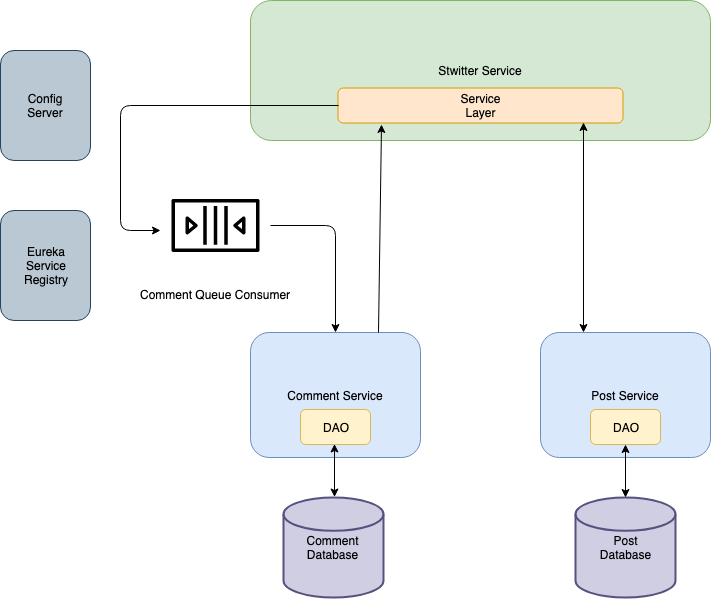

# Stwitter System Project

The purpose of this assessment is to allow you to demonstrate your ability to use queues, edge services, Feign, caching, config servers, and Eureka in a project that requires you to create new code and work with existing code.

## Stwitter

Stwitter (Simple Switter) is a stripped down social media service. The project was started as a proof of concept and the management team now wants you to complete the system for use on the company intranet.

The existing documentation is contained below. Note that this documentation is not complete - you must look at the existing code in some cases.

## System Design





## General Requirements

1. All services must use the Config Server for their configuration settings.
2. All services must register with Eureka.
3. All web service to web service communication must be done using a Feign client.
4. All services must have a complete set of unit/integration tests.
5. All data must be cached as appropriate.

## Component Specifications

### Spring Cloud Config Server

##### Port

Run the Config Server on port 1999.

### Eureka

Run Eureka in the standard configuration.

### Stwitter Service

The Stwitter Service is the edge service with which end user applications (web and mobile) interact. End users are not aware of any other parts of the system.

##### Port

Run the Stwitter Service on port 8889.

##### Stwitter Post and Comment Specification

```
Post:
int: post ID
String: post content
LocalDate: post date
String: poster name
List<String>: comments

Comment:
int: comment ID
int: post id
String: commenter name
LocalDate: comment date
String: comment content
```


##### REST API

```
Create Post
===========
URI: /posts
HTTP Method: POST
RequestBody: Post data (minus ID)
ResponseBody: Post data (including autogenerated ID)

Get Post
========
URI: /posts/{id}
HTTP Method: GET
RequestBody: None
ResponseBody: Post data

Get Posts for Poster
====================
URI: /posts/user/{poster_name}
HTTP Method: GET
RequestBody: None
ResponseBody: Array of Post data

```


### Post Service

The Post Service is responsible for Post CRUD functionality.

##### Port

Run the Post Service on port 1777.

##### Database

```sql
create schema if not exists post;
use post;

create table if not exists post (
	post_id int not null auto_increment primary key,
    post_date date not null,
    poster_name varchar(50) not null,
    post varchar(255)
);
```


### Comment Service

The Comment Service is responsible for Comment CRUD functionality.

##### Port

Run the Comment Service on port 6868.

##### Database

```sql
create schema if not exists comment;
use comment;

create table if not exists comment (
	comment_id int not null auto_increment primary key,
    post_id int not null,
    create_date date not null,
    commenter_name varchar(50) not null,
    comment varchar(255)
);
```


### Comment Queue Consumer

The Comment Queue Consumer grabs new Comments off the queue and sends them to the Create Comment endpoint of the Comment Service.

##### Queue Specs

Queue Name: comment-queue

Exchange Name: comment-exchange

Routing Key: comment.create.#

##### How to run

0. Check out src
    `git clone git@github.com:raghir01/java_bootcamp.git`
1. Start config server in directory spring-config-server
2. Start service registry in directory raghi-r-service-registry
3. Start comment-queue-consumer service in directory comment-queue-consumer
4. Start comment-service in directory comment-service
5. Start post-service in directory post-service
6. Start stwitter-service in directory stwitter-service and access it at localhost:8889


